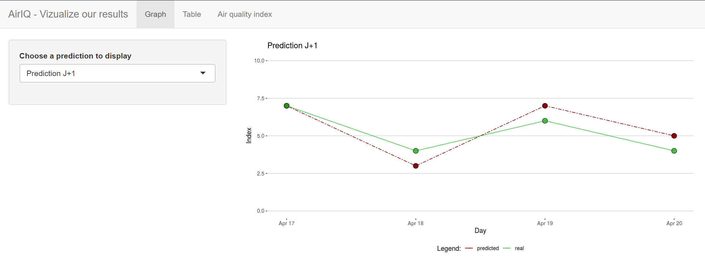

# AIRIQ 2

## Goal of this student project

This is a first year of master research project done by **Mohamed Boulanouar**, **Maxime Thoor** and **Alexandre Verept**, supervised by **Kévin Hérissé** (PhD student) at [**ISEN**](https://www.isen-lille.fr/) engineering school.

The goal of this project is **to predict the air quality** 1, 2 and 3 days in advance in Lille **with the highest accuracy as possible**. 

In a way to accomplish this, we will use some machine learning and statistical techniques.

**NB:** Here you can find **[our first semester project](https://github.com/AlexandreVerept/Projet-AirIQ)**, that consisted in the forecasting of the Air Index quality in Lille, based on only few data collected by a bee hive placed on the roof of the school. We had the chance to present our project in a public event organized by the MEL (*Metropole Européenne de Lille*).

## The result

See the **[result here !](https://alexandre-verept.shinyapps.io/App-prediction/)** (a bit empty for now as the project is not yet over)

## Our project architecture

Here is the general structure of our project:

**Data Collector:**

- This script is running in <u>real time</u> and collect all the data from different APIs, shape them if needed, then send the result to our `Backend API` to be stored in the `Database`.

  

  

**Real-time prediction script:**

- This is the script that run every day in order to <u>make the prediction</u>.
- It ask all the information needed to the `Data Collector`.

**Back and front end API:**

- <u>Receive useful data</u> from the `Data Collector` to store it in the `Data base`.
- <u>Provide data</u> to our real time `Prediction script`, <u>receive the results of the predictions</u> and store them in the `Data base`.

- Used to <u>consult freely</u> our predictions stored in the `Database`.

  - Note: our original plan was to create two distinct APIs so you could find some un-updated references to the `Frontend` and `Backend API` elsewhere on this git.

  

**Data Base:**

- <u>MySQL database</u> used to <u>store all the data we need</u>: the different open source datasets, predictions ...

  

**Final display:**

- Please see [the result](https://alexandre-verept.shinyapps.io/App-prediction/) here made in R with Shiny.

  

## Technologies we used

We have used and learned some technologies and tools during this project:

- Most of our scripts are running using the **Google Cloud Platform**, with a mySQL database and several appEngines.
- Our final visualization is made in R with **Shiny**.
- Both our APIs use **Flask**.
- We trained our models using **Google Colab** and **Tensorflow**.

## What have we learned ?

In a student project, **the most important thing is what we learn from it**, what experience we get:

- As mentioned above, we d**iscovered a lot of technologies by ourselves** to create this product, such as Google Platform for the hosting or Flask for the API. 

- We **improved our skills with Keras and Tensorflow** when it comes to recurrent neural network and architectures with several inputs and outputs.

- As all the work was done within a Covid-19 context, we had to **adapt our methods of teamworking**, especially with the planning.

## Open data

The datasets we use must be a real time data to be useful for the prediction, but we also need archived data over a long period of time in a way to create a training dataset for our predictive model.

**Potential open data APIs to exploit :**

| Name                                                         | Source       | Description                                                  | Frequency     | Time frame                                                   |
| ------------------------------------------------------------ | ------------ | ------------------------------------------------------------ | ------------- | ------------------------------------------------------------ |
| [*Indice qualité de l'air*](https://opendata.lillemetropole.fr/explore/dataset/indice-qualite-de-lair/table/?rows=10000&lang=&sort=date_ech) | MEL          | Air index quality.                                           | Every day     | Window of 5 years with the dataset the MEL send us and the public data online. |
| *[Données SYNOP Essentielles OMM](https://donneespubliques.meteofrance.fr/?fond=produit&id_produit=90&id_rubrique=32)* | Météo France | Wide range of weather data including wind, pressure, humidity and temperature. | Every 3 hours | Since 1997.                                                  |
| [*Historique de l'indice Atmo*](https://www.atmo-hdf.fr/acceder-aux-donnees/historique-des-indices-de-l-air.html) | ATMO         | Provide an index of the daily measures of NO2, O3, and PM10. | Every day     | Since 2012.                                                  |

